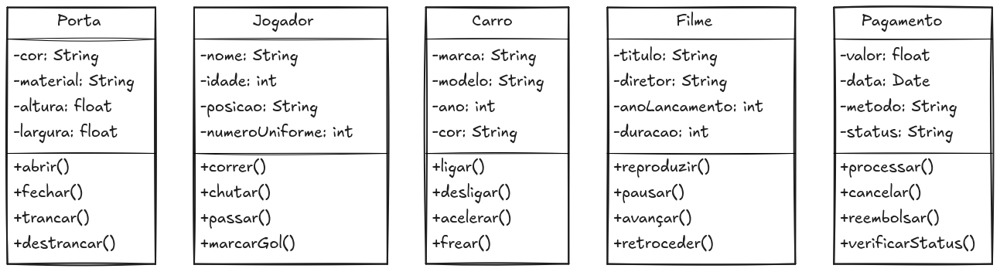

# ENGENHARIA DE SOFTWARE II - ESTUDO DE DIAGRAMA DE CLASSES

> [!NOTE]
> Pasta dedicada ao armazenamento de diagramas de classe produzidos na disciplina de Engenharia de Software II - uma forma de memorizar e absorver melhor o conteúdo, resolvi unir o útil ao agradável para aguçar a percepção analítica na diagramação de classes e caso de uso.

### DIAGRAMAS DE CLASSES

- [x] DIAGRAMA 1
- Criar 5 diagramas de classe básico sem relação.

[voltar para o README inicial](../../../README.md)

